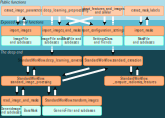

General design
==============

The overall design of MIRP is divided into three layers, as shown in the figure below.

The most visible layer to the user is formed by the functions that are part of the public API. These functions, such as
`extract_features` and `extract_mask_labels`, form entry points that revolve around specific tasks.

The second layer is still public, but rarely directly addressed by users. This layer consists of import routines for
images and masks, as well as settings. The functions from the first, fully public layer, pass arguments to these
functions. Internally, these functions create objects that are then used in the calling function.

* `import_images` creates `ImageFile` objects, or subclasses thereof. These are found in the `mirp._data_import` module.
* `import_masks` creates `MaskFile` objects, or subclasses thereof. Like `ImageFile` (from which `MaskFile` inherits),
  these objects are defined in the `mirp._data_import` module.
* `import_images_and_masks` creates both `ImageFile` and `MaskFile` objects (or subclasses thereof).
  `import_images_and_masks` also associates `ImageFile` objects with their corresponding `MaskFile` objects.
* `import_configuration_settings` creates `SettingsClass` objects, which itself contains several underlying objects for
  configuring various steps in workflows (more on workflows below). These object classes are defined in the
  `mirp.settings` module.

The third layer is fully abstracted from the user.