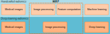

MIRP
====

.. toctree::
   :hidden:
   :maxdepth: 1
   :caption: Getting Started

   introduction
   installation

.. toctree::
   :hidden:
   :maxdepth: 1
   :caption: Tutorials

   tutorial_compute_radiomics_features_mr
   tutorial_apply_image_filter

.. toctree::
   :hidden:
   :maxdepth: 1
   :caption: Deep Dive

   image_mask_import
   configuration
   image_metadata
   mask_labels
   deep_learning
   quantitative_image_analysis

.. toctree::
   :hidden:
   :maxdepth: 1
   :caption: Contributing

   contributing
   design

Welcome to MIRP! If you need to quantitatively analyse medical images using a standardised workflow, you have come to
the right place!

What can MIRP help you do?
--------------------------
MIRP is a python package for quantitative analysis of medical images. It focuses on processing images for integration
with radiomics workflows. These workflows either use quantitative features computed using MIRP, or directly use MIRP
to process images as input for neural networks and other deep learning models.

Supported image and mask modalities
-----------------------------------

.. list-table::
   :widths: 25 25 50
   :header-rows: 1

   * - File format
     - File type
     - Supported modality
   * - DICOM
     - image
     - CT, MR, PT, RTDOSE
   * - DICOM
     - mask
     - RTSTRUCT, SEG
   * - NIfTI
     - any
     - any
   * - NRRD
     - any
     - any
   * - numpy
     - any
     - any

NIfTI, NRRD, and numpy files support any kind of (single-channel) image. MIRP cannot process RGB or 4D images.

Supported Python versions and operating systems
-----------------------------------------------

.. list-table::
   :widths: 10 20 20 20
   :header-rows: 1

   * - Python
     - Linux
     - Windows
     - macOS
   * - 3.10
     - ✅
     - ✅
     - ✅
   * - 3.11
     - ✅
     - ✅
     - ✅

