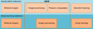

MIRP
====

.. toctree::
   :hidden:
   :maxdepth: 1
   :caption: Getting Started

   introduction
   installation

.. toctree::
   :hidden:
   :maxdepth: 1
   :caption: Tutorials

   tutorial_compute_radiomics_features_mr
   tutorial_apply_image_filter

.. toctree::
   :hidden:
   :maxdepth: 1
   :caption: Documentation and API

   image_mask_import
   configuration
   image_metadata
   mask_labels
   deep_learning
   quantitative_image_analysis
   features_names

.. toctree::
   :hidden:
   :maxdepth: 1
   :caption: Contributing

   contributing
   design
   contributing_tests

Welcome to MIRP! If you need to quantitatively analyse medical images using a standardised workflow, you have come to
the right place!

What can MIRP help you do?
--------------------------
MIRP is a python package for quantitative analysis of medical images. It focuses on processing images for integration
with radiomics workflows. These workflows either use quantitative features computed using MIRP, or directly use MIRP
to process images as input for neural networks and other deep learning models.

Supported image and mask modalities
-----------------------------------

.. list-table::
   :widths: 25 25 50
   :header-rows: 1

   * - Data format
     - Data type
     - Supported modality
   * - DICOM
     - image
     - CT, MR (incl. ADC, DCE), PT, RTDOSE, CR, DX, MG
   * - DICOM
     - mask
     - RTSTRUCT, SEG
   * - NIfTI
     - any
     - any
   * - NRRD
     - any
     - any
   * - numpy
     - any
     - any
   * - MIRP-native
     - any
     - any

NIfTI, NRRD, and numpy files support any kind of (single-channel) image. MIRP cannot process RGB or 4D images.

Supported Python versions and operating systems
-----------------------------------------------

.. list-table::
   :widths: 10 20 20 20
   :header-rows: 1

   * - Python
     - Linux
     - Windows
     - macOS
   * - 3.10
     - ❌ (≥ v2.6.0)
     - ❌ (≥ v2.6.0)
     - ❌ (≥ v2.6.0)
   * - 3.11
     - ✅
     - ✅
     - ✅
   * - 3.12
     - ✅
     - ✅
     - ✅
   * - 3.13
     - ✅
     - ✅
     - ✅
   * - 3.14
     - ✅
     - ✅
     - ✅

Since version 2.6.0, Python 3.10 is no longer available due to lack of support in numpy 2.4.0.
Optional dependencies for parallel processing, i.e. `ray` and `joblib`, may not support all Python versions.

Compatibility
-------------

MIRP is compliant with the Image Biomarker Standardisation Initiative's reference standards for image processing and
feature  computation [Zwanenburg2020]_ and for image filters [Whybra2024]_. Compliance is checked automatically as part
of the software tests.

The reference standards do not cover all possible image pre-processing steps, features or image filters. There are three
pre-processing steps in MIRP that are used by default and that currently lack reference standards, and thus may be
implemented differently in other software packages, or be absent entirely. These are:

1. **Anti-aliasing**: Downsampling, i.e. resampling from a high-resolution scan to a lower-resolution image leads
to aliasing artifacts because the interpolation algorithms will primary use local information from the voxels directly
adjacent to each interpolation point [Zwanenburg2019]_. To counteract this, MIRP by default uses a Gaussian
anti-aliasing filter prior to resampling. This filters smooths local information, prevent anti-aliasing artifacts. To
turn anti-aliasing off set `anti_aliasing = False`.

2. **Use of tissue masks for intensity normalisation**: Intensity normalisation is a pre-processing step commonly
used for harmonising clinical MRI sequences. These methods use information from intensities in a scan. Generally,
information from voxels outside the studied patient (air voxels) are not relevant. By default, MIRP tries to exclude
such voxels by generating a tissue mask based on the intensity distribution, and use only information from voxels
related containing patient tissue for normalisation. To turn tissue masks off, set `tissue_mask_type = "none"`.

3. **Conversion of PET values to SUV**: If PET scans are provided in the DICOM format, by default MIRP will use
information contained in the DICOM headers to compute body-weight corrected standardised uptake values. To use raw PET
information, set `pet_suv_conversion = "none"`. Other types of standardised uptake value can be computed using other
options.

References
----------

.. [Zwanenburg2019] Zwanenburg A, Leger S, Agolli L, Pilz K, Troost EG, Richter C, Löck S. Assessing robustness of
  radiomic features by image perturbation. Scientific reports. 2019;9(1):614. doi:
  `10.1038/s41598-018-36938-4 <https://doi.org/10.1038/s41598-018-36938-4>`_

.. [Zwanenburg2020] Zwanenburg A, Vallieres M, Abdalah MA, Aerts HJWL, Andrearczyk V, Apte A, et al. The Image
  Biomarker Standardization Initiative: Standardized Quantitative Radiomics for High-Throughput Image-based
  Phenotyping. Radiology. 2020;295: 328-338.
  doi:`10.1148/radiol.2020191145 <https://doi.org/10.1148/radiol.2020191145>`_

.. [Whybra2024] Whybra P, Zwanenburg A, Andrearczyk V, Schaer R, Apte AP, Ayotte A, et al. The Image Biomarker
  Standardization Initiative: Standardized Convolutional Filters for Reproducible Radiomics and Enhanced Clinical
  Insights. Radiology. 2024;310: e231319. doi:`10.1148/radiol.231319 <https://doi.org/10.1148/radiol.231319>`_
